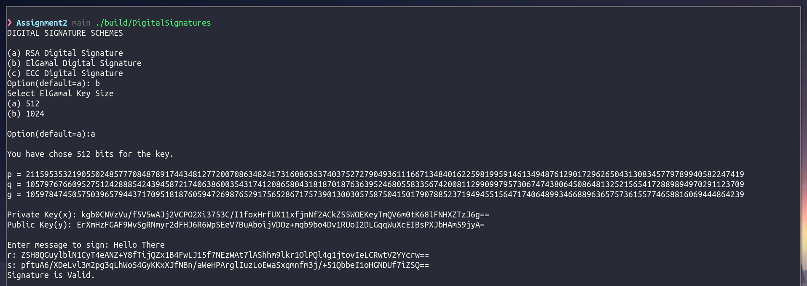

<h1>
    <center>CS4062D Introduction to Information Security</center>
    <center>Assignment 2</center>
</h1>
<p><center>By Dev Sony, B180297CS</center></p>

[Github Repo](https://github.com/HotMonkeyWings/EncryptionAndSignatures)

*The main source code is in `src/`*
## Compile

To compile a .cpp file from `src/`, use the make command as follows
and pass the filename without the extension. The output file will be stored in the
`build/` folder.

```
// make file=<filename>
make file=RSA
```

## Running the Code

To run the code, simply run the output file as per the example given below.

```
// ./build/<filename>
./build/RSA
```

## Extra Notes

Utility files have been added in the `utils/` folder. They contain necessary
functions to facilitate parameter Generation and Convertions.

## Screenshots (Encryption)

### RSA
#### 512 BITS

#### 1024 BITS


### El Gamal
#### 512 BITS

#### 1024 BITS


### ECC


## Screenshots (Digital Signatures)
### RSA


### El Gamal


### ECC
